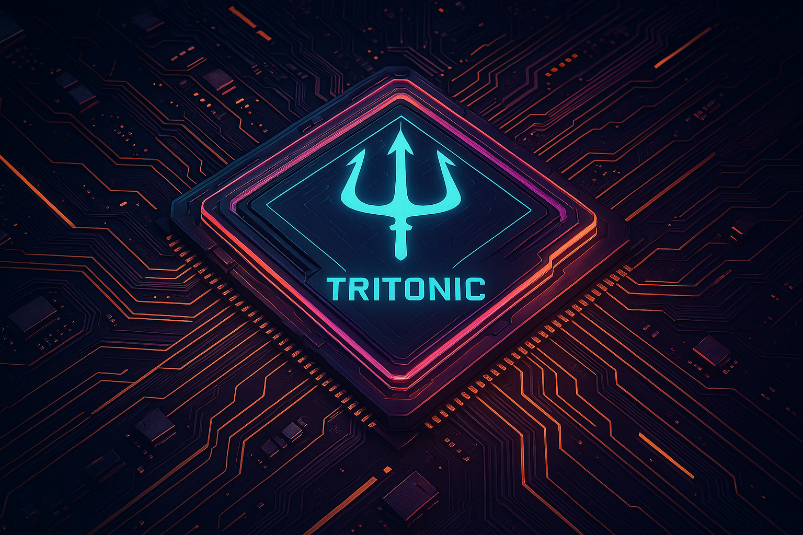

# TritonIC - C++ Triton Inference Client for Computer Vision Models

This C++ application enables machine learning tasks (e.g. object detection, classification, optical flow ...) using the Nvidia Triton Server. Triton manages multiple framework backends for streamlined model deployment.

## Table of Contents
- [Supported Models](#supported-models)
- [Build Client Libraries](#build-client-libraries)
- [Dependencies](#dependencies)
- [Build and Compile](#build-and-compile)
- [Tasks](#tasks)
- [Notes](#notes)
- [Deploying Models](#deploying-models)
- [Running Inference](#running-inference)
- [Docker Support](#docker-support)
- [Demo](#demo)
- [References](#references)
- [Feedback](#feedback)

# Supported (Tested) Models

## Object Detection

- [YOLOv5](https://github.com/ultralytics/yolov5)
- [YOLOv6](https://github.com/meituan/YOLOv6)
- [YOLOv7](https://github.com/WongKinYiu/yolov7)
- [YOLOv8](https://github.com/ultralytics/ultralytics)
- [YOLOv9](https://github.com/WongKinYiu/yolov9)
- [YOLOv10](https://github.com/THU-MIG/yolov10)
- [YOLO11](https://github.com/ultralytics/ultralytics)
- [YOLOv12](https://github.com/sunsmarterjie/yolov12)
- [YOLO-NAS](https://github.com/Deci-AI/super-gradients)
- [RT-DETR](https://github.com/lyuwenyu/RT-DETR/tree/main/rtdetr_pytorch)
- [RT-DETRv2](https://github.com/lyuwenyu/RT-DETR/tree/main/rtdetrv2_pytorch)
- [D-FINE](https://github.com/Peterande/D-FINE)
- [DEIM](https://github.com/ShihuaHuang95/DEIM)
- [RF-DETR](https://github.com/roboflow/rf-detr)

## Instance Segmentation

- [YOLOv5](https://github.com/ultralytics/yolov5)
- [YOLOv8](https://github.com/ultralytics/ultralytics)
- [YOLO11](https://github.com/ultralytics/ultralytics)
- [YOLOv12](https://github.com/sunsmarterjie/yolov12)

## Classification

- [Torchvision Models](https://pytorch.org/vision/stable/models.html)
- [TensorFlow-Keras Models](https://www.tensorflow.org/api_docs/python/tf/keras/applications)

## Optical Flow

- [RAFT](https://pytorch.org/vision/stable/models/raft.html)


## Build Client Libraries

To build the client libraries, refer to the official [Triton Inference Server client libraries](https://github.com/triton-inference-server/client/tree/r24.09).

## Dependencies

Ensure the following dependencies are installed:

1. **Nvidia Triton Inference Server**:
```bash
docker pull nvcr.io/nvidia/tritonserver:25.06-py3
```

2. **Triton client libraries**: Tested on Release r25.06
3. **Protobuf and gRPC++**: Versions compatible with Triton
4. **RapidJSON**:
```bash
apt install rapidjson-dev
```

5. **libcurl**:
```bash
apt install libcurl4-openssl-dev
```

6. **OpenCV 4**: Tested version: 4.7.0

## Build and Compile

1. Set the environment variable `TritonClientBuild_DIR` or update the `CMakeLists.txt` with the path to your installed Triton client libraries.

2. Create a build directory:
```bash
mkdir build
```

3. Navigate to the build directory:
```bash
cd build
```

4. Run CMake to configure the build:
```bash
cmake -DCMAKE_BUILD_TYPE=Release ..
```

Optional flags:
- `-DSHOW_FRAME`: Enable to display processed frames after inference
- `-DWRITE_FRAME`: Enable to write processed frames to disk

5. Build the application:
```bash
cmake --build .
```

## Tasks

### Export Instructions
- [Object Detection](docs/ObjectDetection.md)
- [Classification](docs/Classification.md)
- [Instance Segmentation](docs/InstanceSegmentation.md)
- [Optical Flow](docs/OpticalFlow.md)

*Other tasks are in TODO list.*

## Notes

Ensure the model export versions match those supported by your Triton release. Check Triton releases [here](https://github.com/triton-inference-server/server/releases).

## Deploying Models

To deploy models, set up a model repository following the [Triton Model Repository schema](https://github.com/triton-inference-server/server/blob/main/docs/user_guide/model_repository.md). The `config.pbtxt` file is optional unless you're using the OpenVino backend, implementing an Ensemble pipeline, or passing custom inference parameters.

### Model Repository Structure
```
<model_repository>/
    <model_name>/
        config.pbtxt
        <model_version>/
            <model_binary>
```

To start Triton Server:
```bash
docker run --gpus=1 --rm \
  -p 8000:8000 -p 8001:8001 -p 8002:8002 \
  -v /full/path/to/model_repository:/models \
  nvcr.io/nvidia/tritonserver:<xx.yy>-py3 tritonserver \
  --model-repository=/models
```

*Omit the `--gpus` flag if using the CPU version.*

## Running Inference

### Command-Line Inference on Video or Image
```bash
./tritonic \
    --source=/path/to/source.format \
    --model_type=<model_type> \
    --model=<model_name_folder_on_triton> \
    --labelsFile=/path/to/labels/coco.names \
    --protocol=<http or grpc> \
    --serverAddress=<triton-ip> \
    --port=<8000 for http, 8001 for grpc> \
```

For dynamic input sizes:
```bash
    --input_sizes="c,h,w"
```
#### Debugging Tips
Check [`.vscode/launch.json`](.vscode/launch.json) for additional configuration examples

#### Placeholder Descriptions
- **`/path/to/source.format`**: Path to the input video or image file, for optical flow you must pass two images as comma separated list
- **`<model_type>`**: Model type (e.g., `yolov5`, `yolov8`, `yolo11`, `yoloseg`, `torchvision-classifier`, `tensorflow-classifier`, check below [Model Type Parameters](#model-type-tag-parameters))
- **`<model_name_folder_on_triton>`**: Name of the model folder on the Triton server
- **`/path/to/labels/coco.names`**: Path to the label file (e.g., COCO labels)
- **`<http or grpc>`**: Communication protocol (`http` or `grpc`)
- **`<triton-ip>`**: IP address of your Triton server
- **`<8000 for http, 8001 for grpc>`**: Port number
- **`<batch or b >`**: Batch size, currently only 1 is supported
- **`<input_sizes or -is>`**: Input sizes input for dynamic axes. Semi-colon separated list format: CHW;CHW;... (e.g., '3,224,224' for single input or '3,224,224;3,224,224' for two inputs, '3,640,640;2' for rtdetr/dfine models)


To view all available parameters, run:
```bash
./tritonic --help
```

#### Model Type Tag Parameters
| Model                  | Model Type Parameter   |
|------------------------|------------------------|
| YOLOv5                 | yolov5                 |
| YOLOv6                 | yolov6                 |
| YOLOv7                 | yolov7                 |
| YOLOv8                 | yolov8                 |
| YOLOv9                 | yolov9                 |
| YOLOv10                | yolov10                |
| YOLO11                 | yolo11                 |
| YOLOv12                | yolov12                 |
| RT-DETR                | rtdetr                 |
| RT-DETRV2              | rtdetrv2               |
| RT-DETR Ultralytics    | rtdetrul               |
| RF-DETR                | rfdetr                 |
| D-FINE                 | dfine                  |
| DEIM                   | deim                   |
| Torchvision Classifier | torchvision-classifier |
| Tensorflow Classifier  | tensorflow-classifier  |
| YOLOv5 Segmentation    | yoloseg                |
| YOLOv8 Segmentation    | yoloseg                |
| YOLO11 Segmentation    | yoloseg                |
| YOLO12 Segmentation    | yoloseg                |
| RAFT Optical Flow      | raft                   |


## Docker Support  
For detailed instructions on installing Docker and the NVIDIA Container Toolkit, refer to the [Docker Setup Document](docs/Docker_setup.md).  

### Build

```bash
docker build --rm -t tritonic .
```

### Run Container
```bash
docker run --rm \
  -v /path/to/host/data:/app/data \
  tritonic \
  --network host \
  --source=<path_to_source_on_container> \
  --model_type=<model_type> \
  --model=<model_name_folder_on_triton> \
  --labelsFile=<path_to_labels_on_container> \
  --protocol=<http or grpc> \
  --serverAddress=<triton-ip> \
  --port=<8000 for http, 8001 for grpc>
```

## Demo

Real-time inference test (GPU RTX 3060):
- YOLOv7-tiny exported to ONNX: [Demo Video](https://youtu.be/lke5TcbP2a0)
- YOLO11s exported to onnx: [Demo Video](https://youtu.be/whP-FF__4IM)
- RAFT Optical Flow Large(exported to traced torchscript): [Demo Video](https://www.youtube.com/watch?v=UvKCjYI_9aQ)

## References
- [Triton Inference Server Client Example](https://github.com/triton-inference-server/client/blob/r21.08/src/c%2B%2B/examples/image_client.cc)
- [Triton User Guide](https://docs.nvidia.com/deeplearning/triton-inference-server/user-guide/docs/getting_started/quickstart.html)
- [Triton Tutorials](https://github.com/triton-inference-server/tutorials)
- [ONNX Models](https://onnx.ai/models/)
- [Torchvision Models](https://pytorch.org/vision/stable/models.html)
- [Tensorflow Model Garden](https://github.com/tensorflow/models/tree/master/official)

## Feedback
Any feedback is greatly appreciated. If you have any suggestions, bug reports, or questions, don't hesitate to open an [issue](https://github.com/olibartfast/tritonic/issues).
